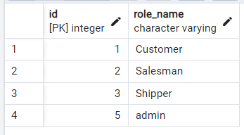
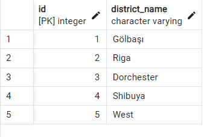
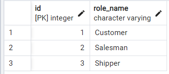
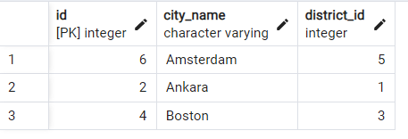
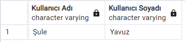
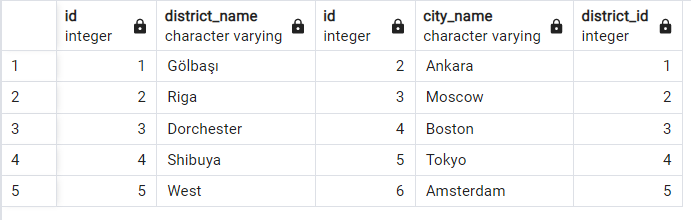
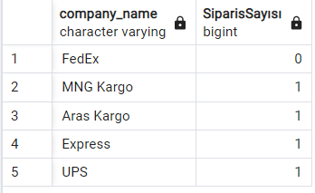
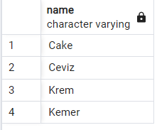

# SQL Example
## 1-ADD

```
insert into role(role_name) values ('admin')
```


## 2-UPDATE
```
Update district set district_name ='Gölbaşı' where district_name = 'Keçiören'
```

## 3-DELETE
```
Delete from role where role_name='admin'
```

## 4-ORDER BY
A-h arasındaki şehir isimleri
```
Select * from city 
where city_name between 'A' and 'H' 
order by city_name
```

## 5-GROUP BY
Ürün sayısına göre kategori sıralaması
```
select Sum(stock), categories.name from categories 
inner join product on categories.id = product.category_id
group by categories.name;
```
## 6-INNER JOIN

Amsterdam' daki userları getir.
```
Select first_name as "Kullanıcı Adı",last_name as "Kullanıcı Soyadı" from users 
inner join address on users.address_id = address.id
inner join country on address.country_id = country.id
inner join city on country.city_id = city.id
where city.city_name = 'Amsterdam'
```

## 7-LEFT JOIN
Bütün bölgeler ve şehirler
```
Select * from district 
left join city on district.id = city.district_id
```

## 8-RIGHT JOIN
Hangi kargo şirketinin ne kadar teslimat yaptığını büyükten küçüğe sırala
```
SELECT shipper.company_name, COUNT(orders.shipper_id) AS "SiparisSayısı"
FROM orders
RIGHT JOIN shipper ON orders.shipper_id = shipper.id
GROUP BY company_name;
```

## 9-AVG
Ürünlerin isimlerinin uzunluğu ortalamanın üzerinde olanların ismi
```
Select product.name from product
where length(name) < (Select AVG(length(product.name)) from product);
```


